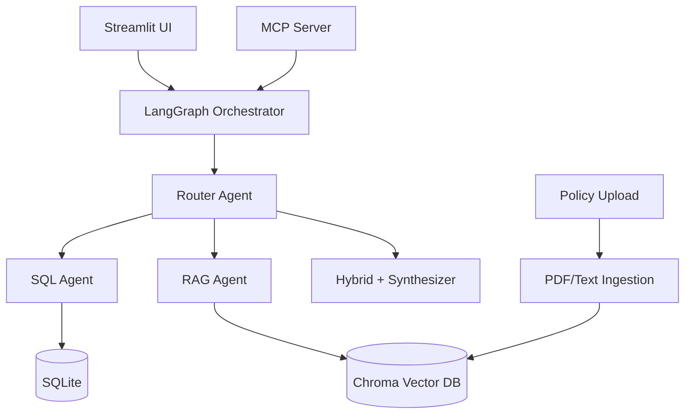

# Customer Support Multi-Agent Chatbot

Generative AI multi-agent assistant for customer support executives. Ask natural-language questions over **structured customer/ticket data** (SQL) and **unstructured policy documents** (vector RAG), orchestrated with **LangGraph** and exposed via an **MCP server**, with a **Streamlit** chat UI.

## Architecture



| Component | Technology |
|-----------|------------|
| Orchestration | LangGraph (router + SQL/RAG/hybrid agents) |
| LLM / embeddings | OpenAI (configurable; Ollama optional) |
| Structured data | SQLite + SQLAlchemy |
| Unstructured data | Chroma + LangChain |
| Server | FastMCP (stdio) |
| UI | Streamlit |

## Features

- Upload policy PDFs/text files and index them for RAG
- Ask policy questions, e.g. *"What is the current refund policy?"*
- Ask customer questions, e.g. *"Give me an overview of customer Ema's profile and tickets"*
- Hybrid routing when a question needs both DB and policy context
- MCP tools for external clients: customer search, ticket lookup, policy search, chat

## Quick start

### 1. Install dependencies

```bash
cd g:\New\chatbot_tcs
python -m venv .venv
.venv\Scripts\activate
pip install -r requirements.txt
```

### 2. Configure environment

```bash
copy .env.example .env
```

Set `OPENAI_API_KEY` in `.env`.

### 3. Seed data

```bash
python scripts/seed_db.py
python scripts/ingest_policies.py
```

This creates synthetic customers (including **Ema Johnson**) with support tickets and indexes sample refund/shipping/privacy policies.

### 4. Run the Streamlit UI

```bash
streamlit run src/ui/streamlit_app.py
```

### 5. Run the MCP server

```bash
python src/mcp_server/server.py
```

MCP tools exposed:

- `mcp_search_customer`
- `mcp_get_customer_profile_and_tickets`
- `mcp_get_support_ticket`
- `mcp_search_policy_documents`
- `mcp_ingest_policy_document`
- `mcp_list_policy_sources`
- `mcp_chat`

Resource: `support://customers/sample`

## Example queries

| Query | Expected route |
|-------|----------------|
| What is the current refund policy? | `rag` |
| Give me a quick overview of customer Ema's profile and past support ticket details. | `sql` |
| Can Ema get a refund for her open duplicate charge ticket? | `hybrid` |

## Project layout

```
src/
  agents/graph.py      # LangGraph multi-agent workflow
  mcp_server/server.py # MCP tool server
  db/                  # SQLite schema + queries
  ingestion/           # PDF/text chunking
  vectorstore/         # Chroma integration
  tools/               # LangChain tools
  ui/streamlit_app.py  # Chat UI
scripts/
  seed_db.py
  ingest_policies.py
data/
  policies/            # Uploaded / sample policies
  customers.db         # Created on seed
  chroma/              # Vector index
```

## Optional: local LLM via Ollama

In `.env`:

```
LLM_PROVIDER=ollama
OLLAMA_MODEL=llama3.2
```

Embeddings still use OpenAI by default; set up a local embedding model separately if needed.

## Assessment mapping

| Requirement | Implementation |
|-------------|----------------|
| NL over structured SQL data | SQL agent + search/profile/ticket tools |
| Unstructured policy KB | PDF/text ingestion + Chroma RAG |
| Multi-agent system | LangGraph router, SQL agent, RAG agent, hybrid synthesizer |
| MCP server | FastMCP in `src/mcp_server/server.py` |
| UI | Streamlit chat + document upload |
