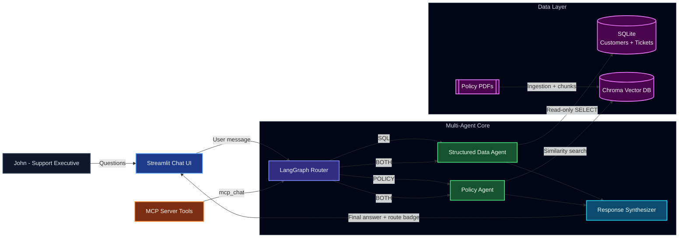

# Multi-Agent Customer Support Assistant

## Overview

This project is a multi-agent customer support assistant that answers natural language questions using:

- Structured customer and ticket data from a SQL database
- Unstructured policy content from uploaded PDFs or text documents

A **LangGraph router** classifies every question and delegates it to the right agent — a SQL agent for customer data, a RAG agent for policy documents, or both with a synthesiser for hybrid questions. The system is exposed as a **FastMCP server** for external tool integration and as a **Streamlit chat UI** for direct use.

---

## Tech Stack

| Layer | Technology |
|-------|------------|
| Orchestration | LangChain, LangGraph |
| LLM + Embeddings | OpenAI (`gpt-4o-mini`, `text-embedding-3-small`) |
| Structured data | SQLite + SQLAlchemy |
| Vector store | Chroma |
| Interface | Streamlit |
| Integration layer | FastMCP server |

---

## Video Walkthrough

[https://vimeo.com/1204729812?share=copy&fl=sv&fe=ci](https://vimeo.com/1204729812?share=copy&fl=sv&fe=ci)

---

## Architecture



---

## Project Layout

```
src/
  agents/graph.py          # LangGraph multi-agent workflow
  mcp_server/server.py     # FastMCP tool server
  db/                      # SQLite schema, connection, queries
  ingestion/               # PDF / text chunking pipeline
  vectorstore/             # Chroma integration
  tools/support_tools.py   # LangChain tools (search, lookup, RAG)
  ui/streamlit_app.py      # Chat UI
  data/sample_policies.py  # Built-in demo policy text
scripts/
  seed_db.py               # Populate SQLite with synthetic data
  ingest_policies.py       # Index policy files into Chroma
data/
  policies/                # Upload target for policy documents
```

---

## Project Setup

> Steps are cross-platform unless explicitly noted.

### Prerequisites

- Python `3.10+`
- OpenAI API key with active quota / billing

### 1. Clone the repository

```bash
git clone https://github.com/Chidu2000/customer-support-agentic-chatbot.git
cd customer-support-agentic-chatbot
```

### 2. Create and activate a virtual environment

**Windows (PowerShell):**

```powershell
python -m venv .venv
.\.venv\Scripts\Activate.ps1
```

**macOS / Linux:**

```bash
python3 -m venv .venv
source .venv/bin/activate
```

### 3. Install dependencies

```bash
python -m pip install --upgrade pip
pip install -r requirements.txt
```

### 4. Configure environment variables

```bash
cp .env.example .env   # Windows: copy .env.example .env
```

Set the required values in `.env`:

```env
OPENAI_API_KEY=your_openai_api_key
OPENAI_MODEL=gpt-4o-mini
OPENAI_EMBEDDING_MODEL=text-embedding-3-small

DATABASE_URL=sqlite:///data/customers.db
CHROMA_PERSIST_DIR=data/chroma
POLICIES_DIR=data/policies
```

Configuration notes:

- `OPENAI_API_KEY` — required for both chat and embeddings.
- `DATABASE_URL` — SQLite file path; created automatically on first seed.
- `CHROMA_PERSIST_DIR` — where Chroma persists its vector index on disk.
- `POLICIES_DIR` — directory where uploaded / sample policy files are saved.

### 5. Seed the SQL database

Populates SQLite with synthetic customers (including **Ema Johnson**, Marcus Lee, Priya Sharma, David Chen) and support tickets:

```bash
python run.py scripts/seed_db.py
```

---

## Usage Instructions

### Start the Streamlit app

```bash
streamlit run src/ui/streamlit_app.py
```

In the running UI:

1. **Upload a policy document** — use the sidebar file uploader to add any PDF, TXT, or MD policy file. It is chunked, embedded, and indexed into Chroma immediately.
2. **Or load sample policies** — click **Load sample policies** in the sidebar to instantly seed built-in refund, shipping, privacy, and warranty policies for demo purposes.
3. **Ask questions** in the chat input at the bottom of the page.

What to expect:

- Every answer shows a **route badge** indicating which agent(s) handled the question:
  - `🗄️ SQL` — answered from the customer database
  - `📄 RAG` — answered from indexed policy documents
  - `⚡ Hybrid` — both agents ran; answer is synthesised
- Policy answers include a **📚 Sources** expander citing the document and page.
- Chat history is maintained within the session for follow-up questions.

### MCP server (optional)

The project includes a FastMCP server (`src/mcp_server/server.py`) that exposes the same multi-agent backend as callable tools for any MCP-compatible client (e.g. Cursor IDE). It is not required to run the Streamlit UI.

```bash
python src/mcp_server/server.py
```

Tools exposed: `mcp_search_customer`, `mcp_get_customer_profile_and_tickets`, `mcp_get_support_ticket`, `mcp_search_policy_documents`, `mcp_ingest_policy_document`, `mcp_list_policy_sources`, `mcp_chat`.

---

## Sample Questions

| Question | Route |
|----------|-------|
| `What is the refund eligibility window?` | RAG |
| `Does cancellation automatically trigger a refund?` | RAG |
| `Show Ema Johnson's profile and past support tickets.` | SQL |
| `Which tickets are high priority and still open?` | SQL |
| `Ema had a duplicate charge — what does the refund policy say about her case?` | Hybrid |
| `Priya Sharma wants to know about the warranty policy for her plan.` | Hybrid |

---

